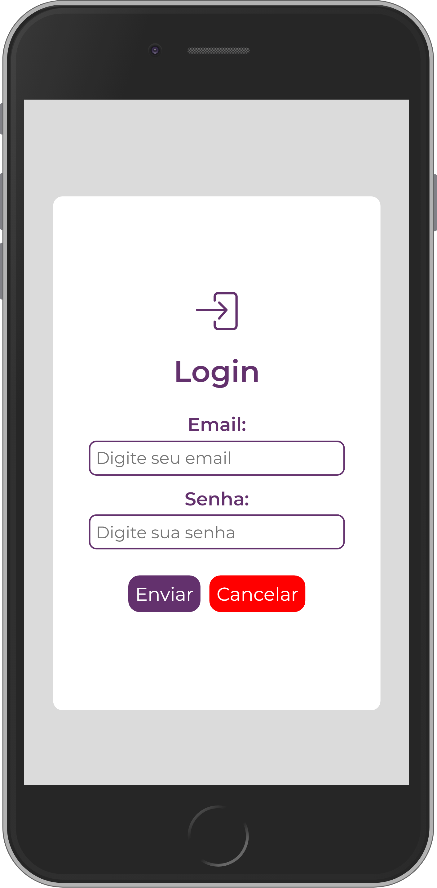

# Certified Tech Developer (Front End II - Aula 07 - Mesa de Trabalho ??)
Este diretório contém todos os exercícios, projetos, micro desafios e mesas de trabalho da disciplina de <b>Front End II</b> realizados por [Ronilson Alves](https://linkedin.com/in/ronilsonalves).
O Conteúdo destina-se à avaliação das habilidades do aluno nas atividades propostas pelos professores.

## Estrutura do projeto:
📄[index.html](/FrontEndII/Aula07/index.html)

📄[form.js](/FrontEndII/Aula07/Encontro/js/form.js) 

🌐 [Veja ao vivo](https://ronilsonalves.github.io/CertifiedTechDeveloper/FrontEndII/Aula07/Encontro/index.html)

### Screenshot

### Aula 07 (24/08/2021) - Prática Integradora - Trabalhando com nós [encontro] (Mesa de trabalho ??) ✔️✔️
#### Exercício Aula 07
<b>Objetivo:</b> Construir um formulário e alterar suas propriedades com JavaScript.

Crie uma nova página HTML e adicione via JavaScript os seguintes elementos:

- 1. Crie um formulário
- 2. Selecione o formulário e salve-o numa variável com querySelector.

Itens a seguir serão inseridos dentro do formulário:

- 3. Um título com o texto: “Login”.
- 4. Um campo de input text com um placeholder: “Email”.
- 5. Um campo de input password com um placeholder: “Senha”.
- 6. Um botão submit com o texto “Enviar”.
- 7. Um botão reset com o texto “Cancelar”.
- 8. Insira a propriedade disabled no campo de Email.
- 9. Insira um estilo da sua escolha, a sugestão seria o display flex com flex-direction column.
- 10. Remova o atributo placeholder do email.