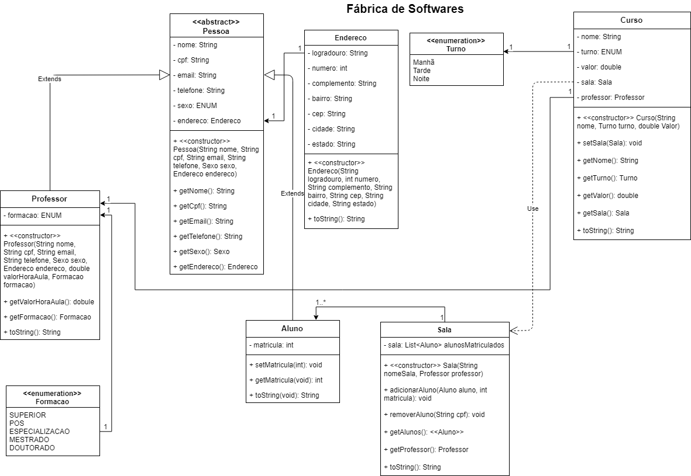

# Checkpoint I - POO - Java
Código escrito por [Ronilson Alves](https://linkedin.com/in/ronilsonalves) para o Checkpoint I da disciplina de Programação Orientada à Objetos do Certified Tech Developer oferecido pelo Mercado Livre e Globant da Digital House.

## Objetivo

O objetivo deste checkpoint é utilizar conceitos de orientação a objetos
apresentados durante o bimestre. O diagrama e código fonte do sistema deverá
ser apresentado junto com uma proposta descrevendo o cenário de aplicação e o
seu diagrama de classes. O checkpoint pode ser realizado em dupla ou individual.

## UML

## Estrutura

Os arquivos .Java estão dispostos seguindo a seguinte estrutura:

- `src` \ `com.ronilsonalves.fabricadesoftwares` : nome do pacote
    - `App`\
        - `Escola.Java`
        - `SysEscola.Java`
    - `entidades`\
        - `Aluno.Java` 
        - `Curso.Java` 
        - `Endereco.Java` 
        - `Pessoa.Java` 
        - `Professor.Java` 
        - `Sala.Java` 
    - `enums` \
      - `Formacao.Java` 
      - `Sexo.Java` 
      - `Turno.Java` 

## Links
[Diretório do Checkpoint I no Github](https://) | [Perfil no LinkedIn](https://linkedin.com/in/ronilsonalves)